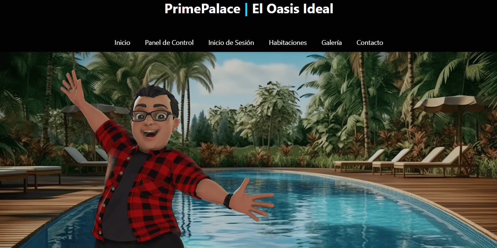
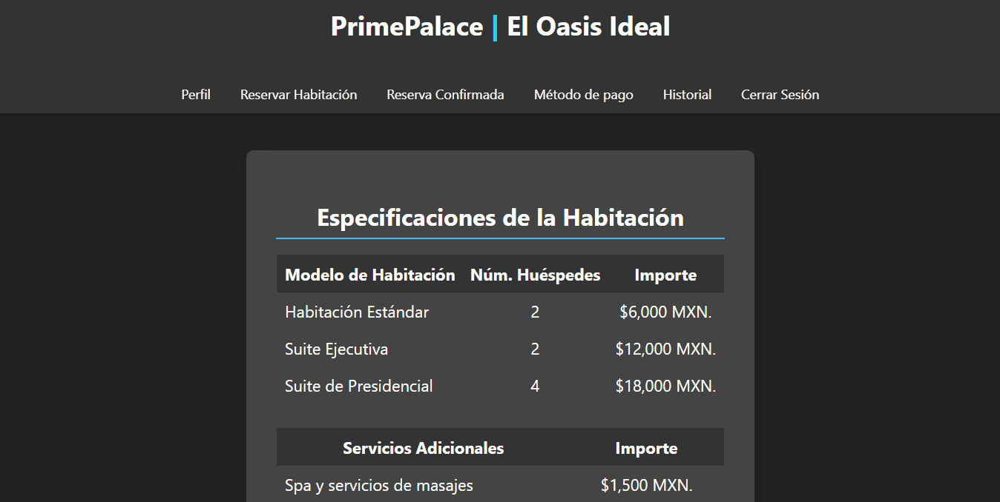
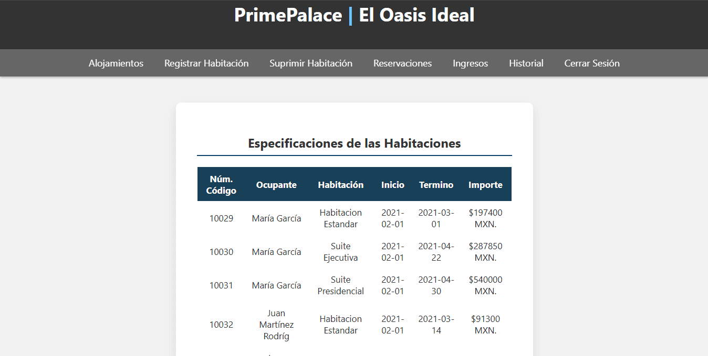

# PrimePalace | El Oasis Ideal

Se ha llevado a cabo el desarrollo de una página web dedicada al hotel **PrimePalace | El Oasis Ideal**, un establecimiento de lujo situado en una playa paradisíaca en México. La página web ofrece una experiencia completa e interactiva para los usuarios, proporcionando información detallada sobre las instalaciones, servicios y opciones de hospedaje que ofrece el hotel.

<p align="center">
  
</p>

La página principal presenta un diseño elegante e intuitivo, destacando un carrusel de imágenes que capturan la esencia del hotel, junto con descripciones cautivadoras de las experiencias y lugares emblemáticos que ofrece el establecimiento. Además, se ofrece una variedad de opciones de alojamiento, que incluyen suites presidenciales, ejecutivas y habitaciones estándar, cada una acompañada de su respectiva descripción y galería de imágenes.

<p align="center">
  
</p>

Los usuarios pueden acceder fácilmente a diferentes secciones de la página a través de una barra de navegación, lo que les permite explorar las habitaciones con detalle, visualizar una galería de imágenes del hotel y realizar reservaciones de manera eficiente. Para los usuarios registrados, se proporciona un portal personalizado donde pueden acceder a su perfil, realizar y gestionar reservaciones, así como explorar su historial de estadías.

<p align="center">
  
</p>

Por otro lado, los administradores tienen acceso a un panel de control completo, desde donde pueden supervisar y gestionar todas las operaciones del hotel. Esto incluye la administración de habitaciones, confirmación de reservaciones, gestión de ingresos y seguimiento del historial de reservaciones. El objetivo principal de este proyecto es proporcionar una plataforma robusta y eficiente que facilite la gestión y operación del hotel, al tiempo que ofrece una experiencia atractiva y satisfactoria para los usuarios.

<p align="center">
  
</p>

El objetivo principal de este proyecto es crear una plataforma web integral que refleje la esencia y calidad del hotel **PrimePalace | El Oasis Ideal**, al tiempo que proporciona a los usuarios una experiencia única y satisfactoria durante su navegación y reserva en línea. Asimismo, se busca optimizar la gestión y operación del hotel a través de un panel de control eficiente y fácil de usar para los administradores.

**Consulta la versión preliminar del proyecto aquí:** [https://primepalace-el-oasis-ideal.com](https://www.alejandrovillegas.net/projects/project-06/index.php)

# 📌 Información del Proyecto

Este proyecto ha sido desarrollado como parte del portafolio de soluciones tecnológicas, con el objetivo de ofrecer una herramienta eficiente y funcional para usuarios autodidactas interesados en la gestión y desarrollo de proyectos web.

- **Área**: Desarrollo de Proyectos Web

- **Usuario Final**: Autodidactas y Desarrolladores

- **Fecha de Desarrollo**: 10 de enero de 2024

- **Portafolio de Proyectos**: [www.alejandrovillegas.net](https://www.alejandrovillegas.net/)

# Guía de Instalación y Configuración del Proyecto

## 🖥️ Requisitos del Sistema

Para ejecutar este proyecto de manera local, es necesario contar con un entorno de desarrollo que incluya Apache, MySQL y PHP. Se recomienda el uso de **XAMPP**, ya que fue el entorno con el que se desarrolló el proyecto. Sin embargo, también es compatible con:

- **XAMPP** (Windows, macOS, Linux)

- **WAMP** (Windows)

- **MAMP** (macOS, Windows)

- **LAMP** (Linux)

## 🔧 Instalación y Configuración del Proyecto

Siga los pasos según el entorno de desarrollo que esté utilizando:

### Para XAMPP (Recomendado)

1. Descargue y descomprima el archivo del proyecto en su sistema local.

2. Copie la carpeta del proyecto y colóquela en el directorio **_htdocs_** dentro de la carpeta de instalación de XAMPP (Ejemplo: **C:\xampp\htdocs\mi_proyecto**).

### Para WAMP

1. Descargue y descomprima el archivo del proyecto.

2. Copie la carpeta del proyecto y colóquela en el directorio **_www_** dentro de la carpeta de instalación de WAMP (Ejemplo: **C:\wamp64\www\mi_proyecto**).

### Para MAMP

1. Descargue y descomprima el archivo del proyecto.

2. Copie la carpeta del proyecto y colóquela en el directorio **_htdocs_** dentro de la carpeta de instalación de MAMP (Ejemplo: **/Applications/MAMP/htdocs/mi_proyecto**).

### Para LAMP

1. Descargue y descomprima el archivo del proyecto.

2. Mueva la carpeta del proyecto a **_/var/www/html/_** utilizando el siguiente comando en la terminal:

```
sudo mv mi_proyecto /var/www/html/
```

## 🗄️ Configuración de la Base de Datos

### Para XAMPP, WAMP y MAMP

1. Inicie su entorno de desarrollo y asegúrese de que **Apache** y **MySQL** estén en ejecución.

2. Abra su navegador y acceda a **_phpMyAdmin_** ingresando:

- **XAMPP**: http://localhost/phpmyadmin

- **WAMP**: http://localhost/phpmyadmin

- **MAMP**: http://localhost:8888/phpmyadmin

3. Diríjase a la pestaña **SQL** e ingrese el siguiente código para crear la base de datos:

```
CREATE DATABASE General;
```

4. Vaya a la pestaña Importar y seleccione el archivo **_DataBase.sql_** del repositorio para importar la estructura y los datos.

### Para LAMP

1. Abra la terminal y acceda a MySQL con:

```
mysql -u root -p
```

2. Cree la base de datos ejecutando:

```
CREATE DATABASE General;
```

3. Salga de MySQL y luego importe la base de datos con:

```
mysql -u root -p General < /ruta/del/archivo/DataBase.sql
```

Reemplace **_/ruta/del/archivo/_** con la ubicación real del archivo en su sistema.

## 🚀 Ejecución del Proyecto

1. Inicie su entorno de desarrollo:

- **XAMPP**: Abra el "Panel de Control de XAMPP" y active **Apache** y **MySQL**.

- **WAMP**: Haga clic en el icono de WAMP y active los servicios.

- **MAMP**: Abra MAMP y haga clic en **Start Servers**.

- **LAMP**: Ejecute los siguientes comandos en la terminal:

```
sudo systemctl start apache2
sudo systemctl start mysql
```

2. Abra un navegador e ingrese la siguiente URL según el entorno:

- **XAMPP / WAMP**: **_http://localhost/_**

- **MAMP**: **_http://localhost:8888/_**

- **LAMP**: **_http://localhost/_**

El proyecto ahora está funcionando en su entorno local. 🎉

## 🔑 Credenciales de Acceso

### 🛠️ Detalles de Inicio de Sesión para Administrador

- Nombre de usuario: **_5574123698_**

- Contraseña: **_Alex1990_**

### 👤 Detalles de Inicio de Sesión para Usuario Preregistrado

- Nombre de usuario: **_Alejandro_**

- Contraseña: **_12345_**

Tambien puede **registrar un nuevo usuario** desde la interfaz de la aplicación.
